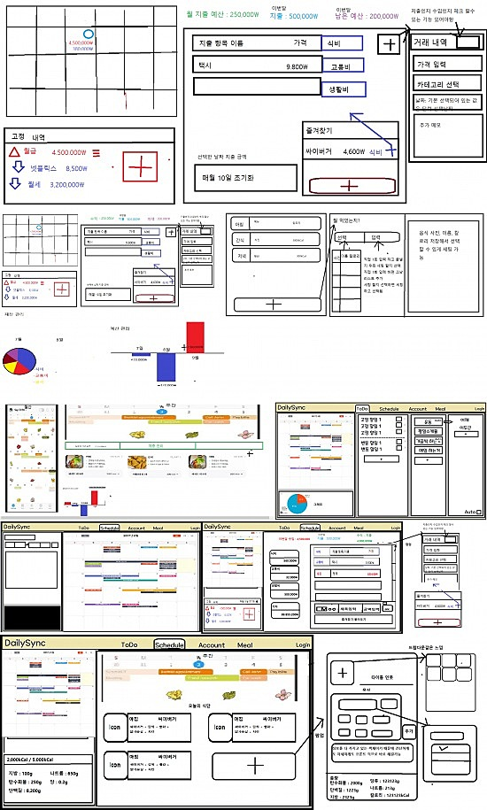

## 프로젝트 배경 및 목적

- 현재 시중에 나와 있는 일정,식단,가계부,To_Do 관리 웹/앱 서비스들은
  기능이 많아 복잡하거나 필요한 기능은 유료 버전으로 사용해야 하는 불편함.
- 이러한 문제를 해결 하기 위해 개인 맞춤형 관리 시스템을 웹으로 개발하여
  본인이 쓰기 가장 쉽고 편하게 UI/UX 를 구성.
- 사용중 불편한 부분과 개선할 부분을 즉각 수정하여 사용할 수 있는 직접 사용할
  나만의 웹페이지 제작이 목표.
- ### 프로젝트 목표 기능
    - **기존 To-Do 기능 강화**: 사용자가 주기적으로 할 일을 설정하고, 이를 매일 자동으로 갱신하여 관리.
    - **고정 소득/지출 관리**: 사용자는 매월 고정된 소득과 지출 항목을 설정하여, 매월 반복적으로 갱신되는 항목들을 자동으로 확인하고 관리.

## 개발 환경

- ### BackEnd - Spring Boot
    - 기본적인 설정이 잘 갖추어져 있고 생태계가 풍부해 정보를 찾기 수월.
    - **Express** 서버에 비해 체계적인 프로젝트 구조를 갖추고 **유지보수**가 유연하고 **가독성** 향상
    - **JPA** 를 사용해 DB에 종속되지 않으며 개발 **편의성** 증가.
    - **Spring Security** 를 사용해 기본적인 **인증/인가** 기능을 구현.
- ### FrontEnd - Vue.js
    - **Component** 기반 구조 덕분에 프로젝트 구조화에 용이.
    - 비교적 편한 **Vue**의 상태관리 라이브러리인 **Pinia**의 편리함.
    - **React** 보다 속도가 빠르고 직관적인 문법과 **Script,template,style** 로 명확하게 나누어진
      구조이기 때문에 직관적인 문법 및 개발속도 증가.
- ### DataBase - MySQL
    - **AWS**의 **EC2**와 유사한 **Oracle** 의 **Cloud Compute** 서비스를 사용하여 **Ubuntu**환경에 **MySQL** 설치 및 사용.

## Tools

- **Git&GitHub** - 협업 및 코드 변경 사항 추적, 원격 저장소
- **Visual Studio Code ( VsCode )** - Frontend (Vue)
- **IntelliJ** - Backend (Spring boot)
- **Oracle Cloud** - 배포 및 DB
- **BeeKeeper Studio** - DB 확인
- **Termius** - Ubuntu 원격 SSH 연결

## 개발 기간

- **2024.12** Team 협업 시작 및 종료.
- **Any** 개인 리펙토링 예정.
    - 각자의 편한 기능이 아닌 나에게 편한 기능으로 수정.
    - 코드 최적화 및 성능 개선.
    - 모든 코드의 Composition Api 및 TypeScript 리펙토링.

## 나의 역할

- **역할**: Spring boot 구조 설계,Vue 구조 설계, 유저 인증/인가를 위해 SpringSecurity 구현, 가계부 기능 구현
- **로그인 JWT 구현**
  - **장점**
    - 상태 없는 인증(Stateless) : 서버 세션을 유지할 필요가 없고 확장성 유리.
    - 간편한 사용자 정보 전달(현재 프로젝트에서는 ID)
  - **단점**
    - 토큰 유효 기간 관리 문제 : 현재 1주일로 설정. 기간내 접속 시 토큰 재발급을 통해 자동 로그인 구현.
    - **Security**의 기본 인증 방식과는 다른 방식으로 인증/인가를 구현해야합.
  - 로그인/ 회원가입/ SWAGGER 페이지 외에 모든 요청에 대해 JWT 인증 요구
    ```
    //SecurityConfig
  
    @Bean
      public SecurityFilterChain securityFilterChain(HttpSecurity http) throws Exception {
          http
                  .cors(cors -> cors.configurationSource(corsConfigurationSource()))
                  .csrf(AbstractHttpConfigurer::disable)
                  .authorizeHttpRequests(authorizeRequests ->
                          authorizeRequests
                                  .requestMatchers("/api/login", "/api/signup").permitAll()
                                  .requestMatchers("/swagger-ui/**", "/v3/api-docs/**").permitAll()
                                  .anyRequest().authenticated()
                  )
                  .addFilterBefore(new JwtAuthenticationFilter(jwtUtil), UsernamePasswordAuthenticationFilter.class);

          return http.build();
      }
  
    //JwtAuthenticationFilter
    ```
  - 필터 생성
    ```
    @RequiredArgsConstructor
    public class JwtAuthenticationFilter extends OncePerRequestFilter {

      private final JwtUtil jwtUtil;

      @Override
      protected void doFilterInternal(HttpServletRequest request, HttpServletResponse response, FilterChain filterChain) throws ServletException, IOException {
          String token = extractToken(request);
          if(token != null && jwtUtil.validateToken(token)){
              Long userId = jwtUtil.extractUserId(token);
              SecurityContextHolder.getContext().setAuthentication(
                      new JwtAuthenticationToken(userId,token)
              );
          }

          filterChain.doFilter(request, response);
      }
    ```
  - 그외 JwtUtil 및 JwtAuthenticationToken 참조.
- 각각의 사용자가 혼자서만 사용하는 공간이기 때문에 실시간 변화에 예민 할 필요 없음
  - 월 별 정보를 그대로 받아 프론트의 상태관리를 최대한 활용해 서버와 통신 횟수를 최소화.
  - 입력 및 수정, 삭제 기능 외의 GET 요청은 현재 보고 있는 월이 바뀔 때만 해당 월에 대한 조회.
- 서버와 통신할 때 응답양식을 통일하기 위해 ApiResponse 객체 도입.
- 예외처리를 위해 가독성을 높이기 위해 GlobalException 도입.


## 프로젝트 진행 이미지

- 프로젝트 협업 Notion
  
  https://adjoining-acorn-1b0.notion.site/DailySync-1467dd3a4f0e80518440dc7a01a04667



## Stack


